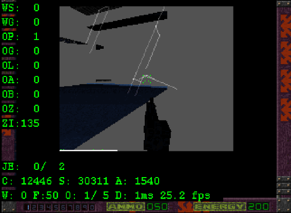
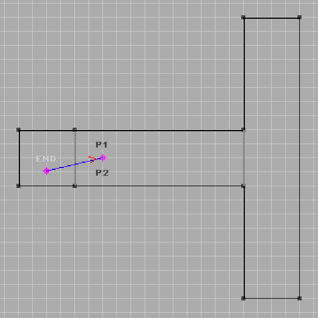
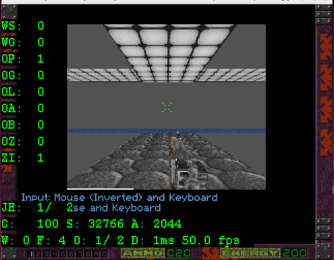

# Potentially Visible Set Rendering

## Map Structure Overview

TKG is a 2.5D game engine. Each level is a 2D map. Points are connected in clockwise order to define convex polygons with 3-10 sides. This polygon, together with height data forms a Zone, which is the fundamental primitive the map is built from. The example image below shows a section of a level map, clearly showing the points and edges that together define the Zones the map is built from.

Notes:

- Solid dark lines indicate a solid "outer" wall edge.
- Lighter grey lines indicate an adjoining edge between Zones.
- Blue lines indicate door or lift zone edges
- Green lines indicate the edges of a zone that has an upper and lower space.

While Zones are required to be convex, it is permitted to have adjacent edges that are completely colinear, i.e. their points fall in a straight line.

What the user thinks of as a "room" may have a more complex, concave shape, such as the left-centre area adjacent Door A in the above map. Neither the engine or the editor has any such concept of a room. Rather this is just a space defined by a set of adjacent Zones that have been given consistent graphical styling.

A Level may have up to 256 Zones defined by up to 800 points (values subject to change). 

## Potentially Visible Sets

It is not possible to see the entire map from any one location. When a map is built, the editor steps through each Zone and compiles a list of every other Zone in the map that has an unblocked line of sight to a point in the Zone. This list forms the Potentially Visible Set or (PVS).

- The PVS also contains the indexes of the Points those Zones are defiend from which allows the runtime to transform and project only the points that matter.
- Information about the edge through which a Zone is seen in is also stored. This allows the renderer to "clip" the maximum rendering extents at runtime.

At runtime, the engine takes note of which Zone the observer is in and is then able to test and render only the subset of Zones that are in that Zone's PVS. This saves a lot of computational effort.

## Rendering

Rendering is very simple. Zones are sorted by their centre weighted distance from the observer and are then rendered from the furthest to the nearest, ensuring that rendering is restricted to any clips that are relevant. Rendering a Zone draws all of the front facing surfaces and any objects it contains.

The solution aims to ensure that:

- Only the Zones in front of, or partially in front of the observer are drawn.
- Each Zone is drawn exactly once.
- Drawing is clipped to the visible width of the edge it is visible through.

The net result is somewhere between a BSP (Convex spaces, precomputed PVS) and Portal renderer.

## Issues

There are some issues and defects with the original solution:

- The PVS determination does not seem to take into account that adjacent Zones can be disconnected due to non-overlapping height ranges.
- The PVS list for a Zone may contain entries that are spatially connected but not visibly connected.
- Runtime application of PVS has to test every Zone in the PVS for rendering. These tests are not comletely reliable and frequently glitch.
    - Glitches can be reduced performance or spurious overdraw events.
- The state of Doors and Lift zones are not taken into consideration.

Invariably, these issues and limitations tend to result in overdraw, where a more distant Zone is rendered, only to be completely drawn over. Examples are shown below:

## Improvements

Various algorithmic modifications have been made to try and improve the performance:

### Zone Order Reduction

Originally, the PVS set for the observer's Zone was sorted on every single frame, regardless of whether or not the observer has moved, which is the only means by which the relative order can change. Moreover, small movements of the observer very rarely affect the outcome of ordering except in rare edge cases.

To address this, a positon mask is defined. This acts to quantise the observer position to a coarser granularity. Zone ordering is only performed when the quantised position changes or the observer changes zone.

### PVS Errata

The first attempt to address overdraw issues targeted the problem cases resulting from bugs in the map creation that led to spurious zones. This mechanism uses a manually created file that contains lists of Zones that contain inclusions in their PVS lists that are never truly visible and should be removed. These files are converted from a JSON file that is user edited. Identification of these issues involves testing the level in the developer build to identify problem cases.

At runtime, any loaded errata data is applied to the corresponding PVS data by cutting out entries and moving down the remainder.

### Per Edge PVS

The PVS Errata mechanism is rather laborious and doesn't deal with other classes of bugs that can manifest at runtime. For example, the visibility of indirectly connected zones can change depending on the orientation of the observer, resulting in significant overdraw that is not correctable via the Errata method.

To address this, a new load-time mechanism has been added. This visits every Zone in the map and then examines the PVS from the perspective of each of the Zone's joining edges. Generally, where a Zone has more than one shared edge, only a subset of the Zone's PVS will ever be visible via that edge.

The algorithm steps out of each shared edge and then examines the shared edges of the Zone it entered, making note of those that are still front facing from the perspective of the root Zone. This process recurses, marking the subset of the PVS that can be seen from each edge of the Zone.

At runtime, we start with the assumption that only the current zone is visible. Next the observer's orientation and field of view is used to determine which shared edges in the current Zone are visible. The zones in the PVS are then tagged as visible or not by checking the per-edge data that was calculated. During the render stage, only the zones from the PVS that were tagged are drawn.

### Adjacent Zone Clips Enhancement

During the rendering pass, clips are applied to every Zone that is more than one hop away from the Root. The data to drive that is generated during map building. The Zones immediately adjacent the current Zone do not have these data available. Consequently, the immediately adjacent zones are always rendered with the clip extents set to maximum width. This results in an overdraw case shown below:

Facing the T-junction, no clips are applied to the adjoining zone, resulting in the full horizontal extent being used. With wall rendering disabled, we can see the impact this has on drawing:

To address this case, we identify the indexes coordinates of the immediately joining edges in the Point data during the Edge PVS processing and ensure they are added to the transformation buffer.

This allows the horizontal extent of the current Zone's shared edge with an adjoing zone to be found post transformation. These are then used to refine the clip extents for the adjacent zone, reducing overdraw in cases where the adjoining zone is larger than the edge.

This mechanism was improved one further step by considering the the complete extent for any immediate shared edges that are visible simultaneously. Without this, the clipping could only be applied when a single shared edge was visible.

### Per Edge Door Mask

TODO
